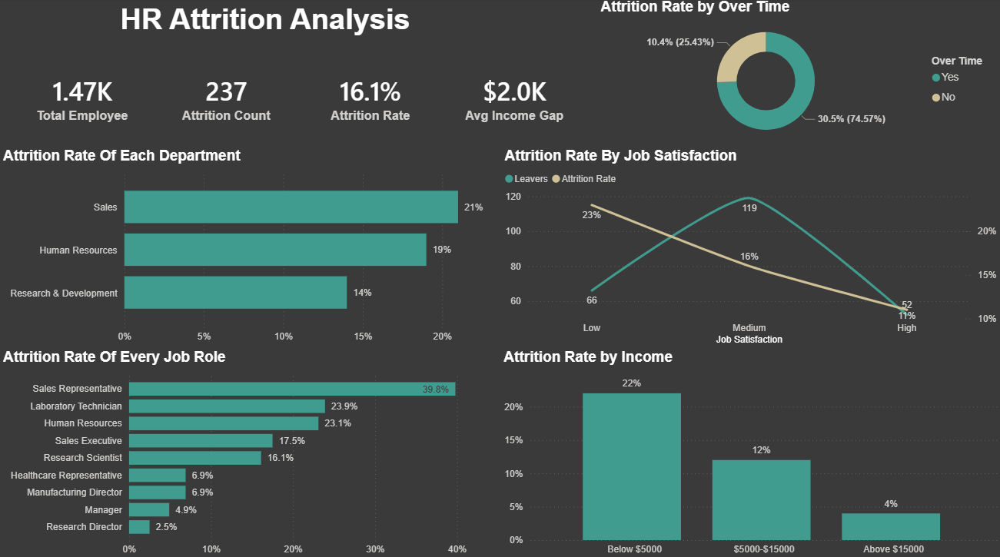
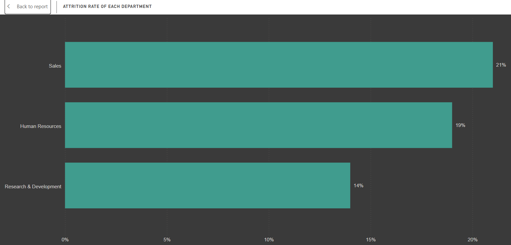
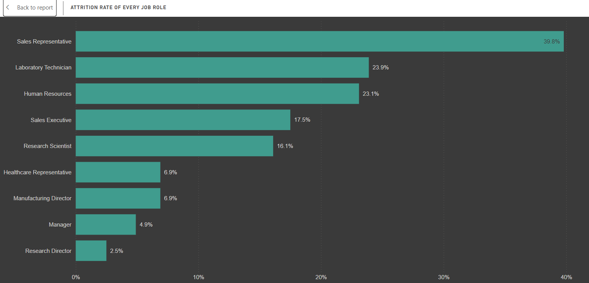
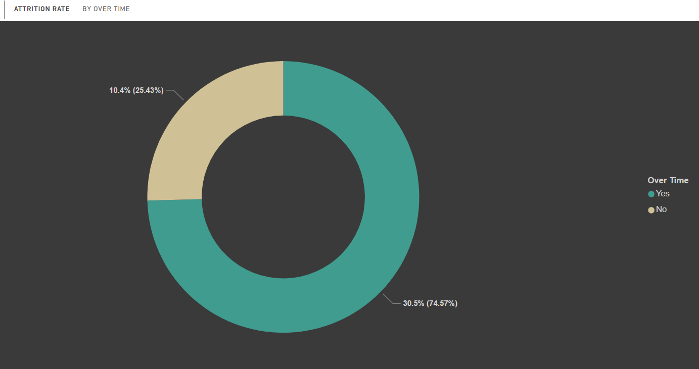
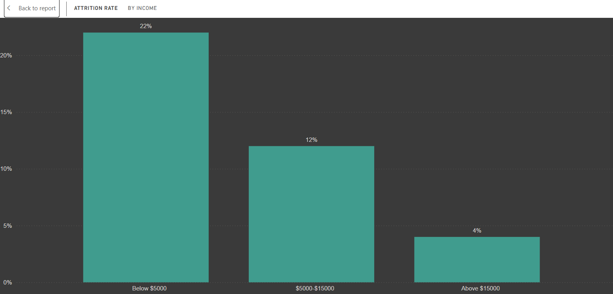
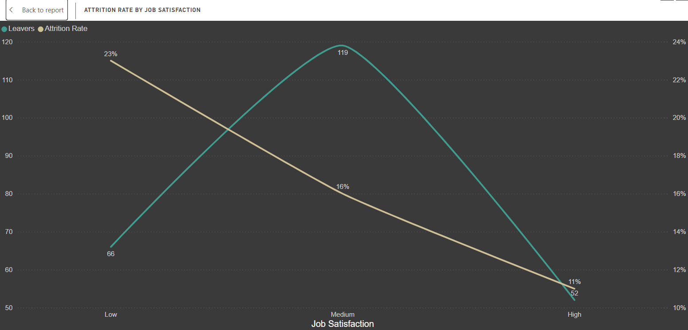

# HR Attrition Analysis

A SQL and Power BI portfolio project analyzing employee attrition drivers 
across a workforce of 1,470 employees.

**Tools:** SQL Server · DBeaver · Power BI · Excel  
**Dataset:** IBM HR Analytics Employee Attrition - 1,470 employees · 35 columns

---

## Business Question
> *"Which departments and employee profiles have the highest attrition 
> risk, and what factors are driving people to leave?"*

---

## Dashboard Overview

Overall attrition rate stands at 16%, with 237 employees leaving out of 
1,470 total. The dashboard breaks this down by department, role, overtime 
status, income, and job satisfaction to identify where and why attrition 
is concentrated.

---

## Analysis & Findings

### 1. Attrition by Department

**What I did:** Calculated attrition rate by department by comparing 
total leavers against total headcount per department.

**What I found:**
- Sales has the highest departmental attrition rate at 21% (92 of 446 employees)
- HR follows at 19% (12 of 63 employees)
- R&D has the lowest rate at 14%, despite having the most total leavers 
  (133) due to its much larger headcount a reminder that rate matters 
  more than raw count

---

### 2. Attrition by Job Role

**What I did:** Broke attrition down by specific job role rather than 
department, to identify which roles are the real retention problem.

**What I found:**
- Sales Representative has by far the highest attrition rate at 39.8% nearly 1 in 2 employees in this role leave
- Laboratory Technician follows at 23.9%
- Senior roles like Research Director (2.5%) and Manager (4.9%) are the 
  most stable, showing a clear link between seniority and retention

---

### 3. Does Overtime Drive Attrition?

**What I did:** Compared attrition rates between employees who work 
overtime and those who don't.

**What I found:**
- Employees who work overtime leave at nearly 3x the rate of those who 
  don't 30.5% vs 10.4%
- This is the strongest single finding in the analysis and points to 
  workload and burnout as a major driver of attrition

---

### 4. Income vs Attrition

**What I did:** Grouped employees into income bands and compared 
attrition rates across them, then separately compared average income 
between leavers and retained employees.

**What I found:**
- Attrition rate drops sharply as income rises 22% for employees 
  earning below $5,000/month, 12% for $5,000–$15,000, and just 4% for 
  employees earning above $15,000/month
- Employees who left averaged $4,787/month compared to $6,832/month for 
  retained employees a $2,045 gap

---

### 5. Job Satisfaction vs Attrition

**What I did:** Binned job satisfaction scores (1-4 scale) into Low, 
Medium, and High categories and compared attrition rates across them.

**What I found:**
- Attrition rate is 23% for employees reporting low satisfaction, 16% 
  for medium, and 11% for high
- A clear, consistent pattern showing satisfaction is strongly linked 
  to retention, independent of pay or overtime

---

## Recommendation

See [`recommendation.md`](recommendation.md) for the full findings, 
root cause analysis, and action recommendations.

---

## Repository Structure

hr-attrition-analysis/  
├── README.md  
├── recommendation.md  
├── queries/  
│   └── attrition_analysis.sql  
├── dashboard/  
│   └── hr_attrition_dashboard.pbix  
├── image/  
│   └── dashboard_preview.png  
└── data/  
   └── dataset_notes.md

## SQL Queries

Five queries covering the full analysis see 
[`queries/attrition_analysis.sql`](queries/Attrition_Analysis.sql):

1. Overall Attrition Rate by Department
2. Attrition by Job Role
3. Does Overtime Drive Attrition?
4. Income Band vs Attrition Rate, and Average Income - Leavers vs Retained
5. Job Satisfaction vs Attrition